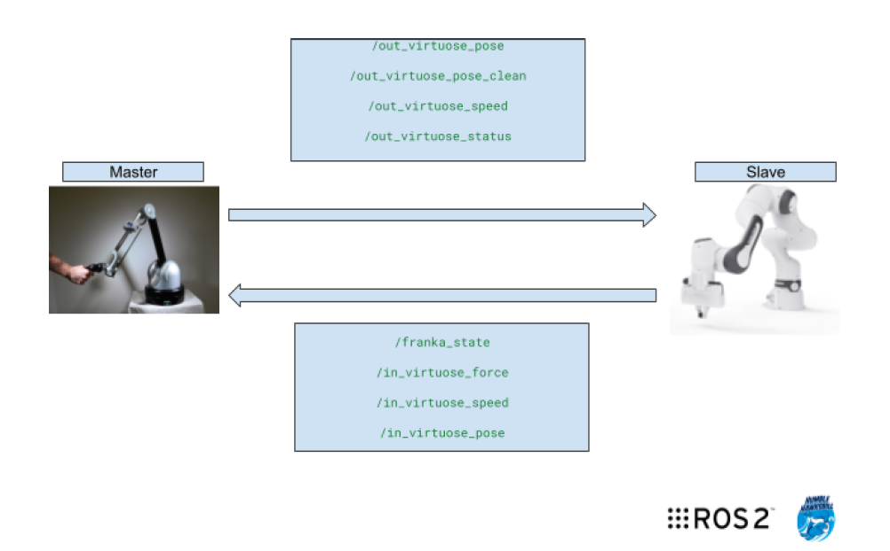
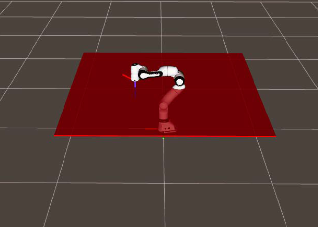
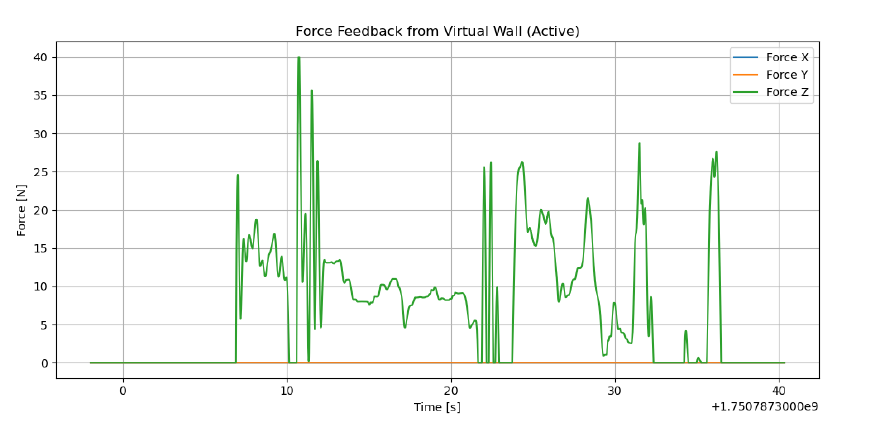

# ROS 2-Based Robotised Tele-Echography

**M1 Advanced Robotics Project — École Centrale de Nantes**  
**2025**

This project was carried out as part of my M1 Advanced Robotics programme (CORO-IMARO) at École Centrale de Nantes. The project focused on developing a ROS 2-based bilateral teleoperation framework using a Haption Virtuose 6D haptic interface and a Franka Emika Panda collaborative robot for robotised tele-echography.

## Why This Project?

Ultrasound examinations normally require a trained medical practitioner to physically manipulate the ultrasound probe while controlling the contact with the patient. This can limit access to specialised examinations in locations where experienced practitioners are not available.

Robotised tele-echography provides an alternative in which the practitioner remotely controls a robotic manipulator carrying the ultrasound probe. For this interaction to be useful, the system must not only reproduce the operator's hand motion but also provide force feedback so that the operator can perceive the interaction occurring at the remote site.

## Project Objective

The objective was to develop a **ROS 2-based bilateral teleoperation framework** in which:

1. The **Haption Virtuose 6D** acts as the master device and captures the operator's position and orientation commands.
2. The **Franka Emika Panda** acts as the slave robot and follows the commanded Cartesian motion.
3. A **Cartesian impedance controller** provides compliant robot motion.
4. Force feedback is transmitted back to the haptic device, closing the bilateral teleoperation loop.

## System Architecture

The teleoperation system was developed in **ROS 2 Humble** and consists of two main sides:

- **Master side:** The Haption Virtuose 6D captures the operator's motion and provides haptic force feedback.
- **Slave side:** The Franka Emika Panda follows the commanded motion using Cartesian impedance control.

The operator's 6-DoF pose is transmitted from the Virtuose to the Franka controller through ROS 2. In the opposite direction, force feedback is sent from the robot side to the Virtuose, forming a bilateral communication loop.

  

  <em>ROS 2 bilateral communication architecture between the Haption Virtuose 6D and Franka Panda.</em>

## Haption-to-Franka Teleoperation

The **Haption Virtuose 6D** is used to command the desired position and orientation of the Franka end-effector.

The Virtuose publishes its pose through a device-specific ROS 2 message. A **Python pose relay node** was implemented to convert this data into the standard `geometry_msgs/msg/PoseStamped` format used by the robot controller.

The communication pipeline is:

`Virtuose 6D → Raw Pose → Python Pose Relay → PoseStamped → Cartesian Impedance Controller → Franka Panda`

The pose relay subscribes to `/out_virtuose_pose` and republishes the converted command on `/out_virtuose_pose_clean`. The Cartesian impedance controller then uses this pose as the desired end-effector command.

## Cartesian Impedance Control

The Franka Panda was controlled using a **Cartesian impedance controller implemented in C++** to provide compliant end-effector motion.

The controller computes the Cartesian pose error between the commanded and current end-effector pose. A virtual spring-damper model generates the Cartesian wrench:

**F = K(xᵈ − x) + D(ẋᵈ − ẋ)**

where `K` and `D` are the Cartesian stiffness and damping matrices, and `(xᵈ − x)` represents the end-effector pose error.

The resulting Cartesian wrench is converted into joint torques using the Jacobian transpose:

**τ = JᵀF**

where `J` is the robot Jacobian, `F` is the Cartesian wrench, and `τ` is the commanded joint torque.

Forward kinematics and the robot Jacobian were computed using the **Kinematics and Dynamics Library (KDL)**, a library for robot kinematics and dynamics calculations.

## Haptic Force Feedback

To complete the bilateral teleoperation loop, a **restoring force is sent back to the Haption Virtuose 6D** through the `/in_virtuose_force` ROS 2 topic.

The feedback is generated from the difference between the commanded Haption pose and the actual Franka end-effector pose. The architecture supports **6-DoF force and torque feedback**, while the experimental testing focused mainly on the **Z-axis**.

### Virtual Wall Test

A virtual wall perpendicular to the Z-axis was implemented to evaluate the haptic feedback. When the robot reaches the virtual boundary, a restoring force is generated and transmitted to the Haption device, allowing the operator to feel resistance.

  

  <em>Virtual wall used to evaluate Z-axis haptic force feedback.</em>

## Experimental Demonstrations

### Bilateral Teleoperation

The videos below demonstrate the teleoperation system in both **simulation and on the physical Franka Panda**. Motion of the **Haption Virtuose 6D** is transmitted through ROS 2 and used as the desired end-effector motion for the Cartesian impedance controller.

#### Simulation

The Haption Virtuose 6D is used to teleoperate the Franka Panda in simulation.

https://github.com/user-attachments/assets/f77e8a96-4e3d-447e-ac4b-375fd11c3c76

#### Real Robot

The same teleoperation framework is demonstrated on the physical Franka Panda.

https://github.com/user-attachments/assets/3957cb76-b110-428a-8dc5-0edb2b4d01ac

### Virtual Wall Force Feedback

The video below demonstrates the **haptic force-feedback response** during the virtual-wall experiment. When the virtual boundary is reached, a restoring force is generated and transmitted to the Haption Virtuose 6D, allowing the operator to feel the constraint.

https://github.com/user-attachments/assets/4b85775f-1925-421b-b627-680153e07f2f

#### Force Feedback Response

The plot below shows the **Z-axis force response** generated during interaction with the virtual wall.

  

  <em>Z-axis force-feedback response during the virtual-wall experiment.</em>

## What Was Achieved

- Developed a **ROS 2-based bilateral teleoperation framework** between the Haption Virtuose 6D and Franka Panda.
- Implemented **Cartesian impedance control in C++** for compliant end-effector motion.
- Used **KDL** for forward kinematics and Jacobian computation, with Cartesian wrenches mapped to joint torques using the Jacobian transpose.
- Developed a **Python pose relay node** to interface the Haption pose data with the robot controller.
- Implemented **haptic force feedback** and evaluated it using a Z-axis virtual wall.
- Demonstrated the teleoperation framework in both **simulation and on the physical Franka Panda**.

## Tools and Technologies

- **Robotics:** ROS 2 Humble, Franka Panda, Haption Virtuose 6D
- **Programming:** C++, Python
- **Control:** Cartesian Impedance Control, Bilateral Teleoperation, Haptic Force Feedback
- **Kinematics:** KDL, Forward Kinematics, Jacobian Computation
- **Simulation & Analysis:** Gazebo, RViz, RQT, ROS 2 Bag

